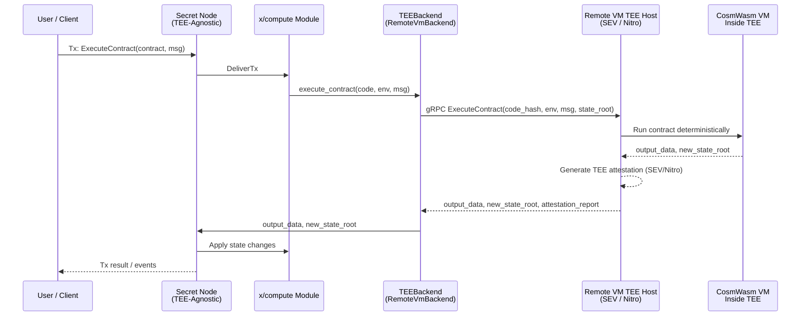
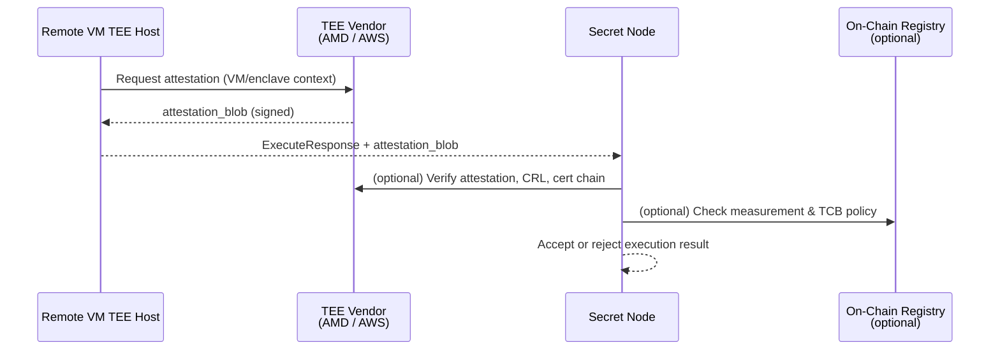

````markdown
# ARCHITECTURE

> **Project:** Secret Network – TEE-Agnostic Node (SGX, AMD SEV, AWS Nitro)  
> **Status:** Experimental / R&D

This document describes the high-level architecture of a **TEE-agnostic Secret node** that can, in principle, support multiple **CPU/VM TEEs**:

- Intel SGX (current production TEE),
- AMD SEV / SEV-SNP (confidential VMs),
- AWS Nitro Enclaves (isolated VMs in AWS).

The goals are:

- clean separation between **consensus / state machine** and **TEE-specific execution**;
- ability to prototype **alternate CPU TEEs** without touching the core logical semantics of the chain;
- maintain compatibility with existing SGX-only nodes (for devnet/testnet scenarios).

**Note:** GPU TEEs (e.g., NVIDIA Blackwell) are explicitly **out of scope for node execution** here. They may be used in separate **off-chain confidential AI/oracle services**, documented elsewhere.

---

## 1. Component Overview

The system consists of three main layers:

1. **TEE-Agnostic Secret Node**  
2. **Remote VM TEE Hosts (SEV / Nitro)**  
3. **On-Chain TEE/TCB Registry (optional, future)**

### 1.1 Component Diagram

```mermaid
graph LR
  subgraph SecretNode["Secret Node (TEE-Agnostic)"]
    A[Cosmos SDK<br/>+ CometBFT]
    B[x/compute Module<br/>+ CosmWasm Integration]
    C[TEEBackend Interface]
    C1[SgxBackend]
    C2[RemoteVmBackend<br/>(SEV / Nitro)]
  end

  subgraph RemoteTEE["Remote VM TEE Hosts"]
    D[gRPC / RPC Server]
    E[Confidential VM / Enclave<br/>(SEV-SNP or Nitro)]
    F[CosmWasm VM<br/>Inside TEE]
  end

  subgraph OnChain["On-Chain (Secret)"]
    G[Contracts / Modules]
    H[TEE/TCB Registry<br/>(future, optional)]
  end

  A --> B
  B --> C
  C --> C1
  C --> C2

  C2 -->|Execute/Query| D
  D --> E
  E --> F
  F --> D
  D -->|Result + Attestation| C2

  A --> G
  G --> H
````

**Key ideas:**

* The Secret node relies on a **`TEEBackend` interface** rather than hard-coding SGX.
* `SgxBackend` preserves the current SGX behaviour.
* `RemoteVmBackend` delegates contract execution to a **confidential VM/enclave** based on AMD SEV-SNP or AWS Nitro.
* An optional **TEE/TCB Registry** can store whitelisted measurements and attestation policies.

---

## 2. TEE Backend Abstraction

The `TEEBackend` abstraction decouples:

* **Node logic** (Cosmos SDK, CometBFT, `x/compute`)
  from
* **TEE implementation** (SGX enclave vs remote SEV/Nitro VM).

### 2.1 Conceptual Interface

Conceptually, the backend interface looks like:

```text
TEEBackend
 ├─ init(config)
 ├─ execute_contract(code, env, msg) -> bytes
 ├─ query_contract(code, env, msg) -> bytes
 ├─ get_consensus_keys() -> ConsensusKeys
 └─ attest() -> AttestationReport
```

Concrete implementations:

* **`SgxBackend`**:

  * uses the existing SGX enclave, ECALL/OCALL bindings and Intel DCAP attestation path;
* **`RemoteVmBackend`**:

  * sends execution requests over a secure RPC channel to a remote TEE host (SEV-SNP VM or Nitro Enclave),
  * receives execution results and an attestation document.

---

## 3. Execution Flow (Remote VM Backend)

This section describes the execution flow when a contract is handled via `RemoteVmBackend`.

### 3.1 Sequence Diagram – Contract Execution (Remote VM)



**Notes:**

* All semantics of CosmWasm execution remain the same; only the “where” changes (local SGX vs remote VM TEE).
* Determinism is enforced at the VM level: given identical inputs, all honest TEEs must return identical outputs.

---

## 4. Attestation and Trust Model

The architecture provides a **generic attestation abstraction** to cover SGX, SEV and Nitro.

### 4.1 Generic Attestation Structure

Conceptually, inside the node we can represent attestation as:

```text
AttestationReport
 ├─ tee_kind        (IntelSgx | AmdSevSnp | AwsNitro)
 ├─ measurement     (hash of VM/enclave code + config)
 ├─ vendor_sig      (signature or proof from vendor root-of-trust)
 ├─ tcb_version
 └─ timestamp
```

* `tee_kind`

  * identifies which TEE implementation produced the report.
* `measurement`

  * uniquely identifies the code/config image running inside the TEE.
* `vendor_sig`

  * allows the node to verify authenticity, using vendor libraries or a local CA bundle.
* `tcb_version` / `timestamp`

  * useful for enforcing minimum patch levels and freshness.

### 4.2 Attestation Flow (Remote VM)



Two possible verification modes:

1. **Off-chain verification**

   * Node uses vendor libraries to verify the attestation blob (SEV-SNP report, Nitro document, etc.).
2. **On-chain registry (future)**

   * Node also checks that `measurement` and `tcb_version` are whitelisted in an on-chain TEE registry.

---

## 5. Compatibility with Existing SGX Nodes

The design is deliberately structured to **coexist** with SGX-only nodes.

### 5.1 Dual Backend Strategy

* **SGX nodes (current behaviour):**

  * `TEEBackend` is configured to use `SgxBackend`.
  * Runtime semantics are unchanged; they still use local SGX enclaves.

* **Experimental nodes (R&D):**

  * `TEEBackend` is configured to use `RemoteVmBackend`.
  * They offload contract execution to remote SEV/Nitro hosts.

As long as:

* CosmWasm execution remains deterministic, and
* the same contract inputs are provided,

both SGX and SEV/Nitro backends **should produce the same state transitions**. Mixed testnets can be used to verify this in practice.

### 5.2 Deployment Modes

1. **Isolated Devnet (Remote TEE only)**

   * Only `RemoteVmBackend` nodes; used to validate TEE integration and attestation logic.

2. **Mixed Testnet (SGX + Remote)**

   * Some nodes use `SgxBackend`, some use `RemoteVmBackend`.
   * Useful to detect divergence, non-determinism, or performance/pathological behaviours.

3. **Mainnet (Hypothetical, Long-Term)**

   * Would require:

     * governance decisions,
     * security audits,
     * clearly defined trust policies.
   * Out of scope for this R&D phase.

---

## 6. Failure Modes and Fallbacks

The architecture must handle failures without compromising consensus integrity.

### 6.1 Remote Host Failure / Timeout

If the remote TEE host is unavailable or times out:

* `RemoteVmBackend` should:

  * fail the execution gracefully, logging diagnostics, or
  * (if configured and safe) fall back to a local SGX backend for that node.

### 6.2 Attestation Failure

If attestation verification fails:

* The execution result **must be rejected**.
* The node should:

  * log the failure,
  * flag the host / TEE instance as untrusted until fixed.

### 6.3 Non-Determinism / Divergence

If SGX and RemoteVm backends disagree in devnet/testnet on the result of the same input:

* That is treated as a critical bug in the R&D stack:

  * identify the source (VM differences, syscall differences, time/rand usage, etc.);
  * do not promote the multi-TEE design further until resolved.

---

## 7. Out-of-Scope: GPU TEEs and Blackwell

GPU TEEs (e.g., NVIDIA Blackwell Confidential Computing) are **not used** to run Secret nodes in this architecture.

* The Secret node and TEE execution remain **CPU/VM-based** (SGX, SEV, Nitro).
* Any use of GPU TEEs is considered a **separate, off-chain system**, such as:

  * confidential AI oracles,
  * private analytics engines,
  * heavy ML/quant workloads feeding data into Secret.

Such systems would:

* run independently of the node consensus path,
* integrate with Secret via standard transactions, oracles, or IBC-like mechanisms,
* be documented in a separate `CONFIDENTIAL_AI_ORACLE.md` or similar.

---

## 8. Summary

This architecture:

* Introduces a **TEE abstraction layer** (`TEEBackend`) in the Secret node implementation;
* Allows the existing **SGX enclave** to remain first-class, while enabling experiments with:

  * **AMD SEV-SNP**,
  * **AWS Nitro Enclaves**,
    as **Remote VM TEE backends**;
* Provides a **generic attestation model** that can represent multiple CPU TEEs;
* Explicitly avoids using GPUs for node execution, aligning with the current Secret design and security expectations.

The goal is to create a **research-friendly, modular** foundation to explore multi-TEE node designs without compromising the stability or assumptions of the existing SGX-based network.

---

```
::contentReference[oaicite:0]{index=0}
```
