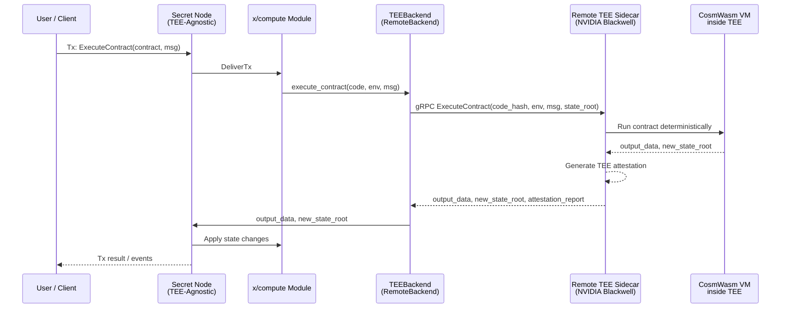
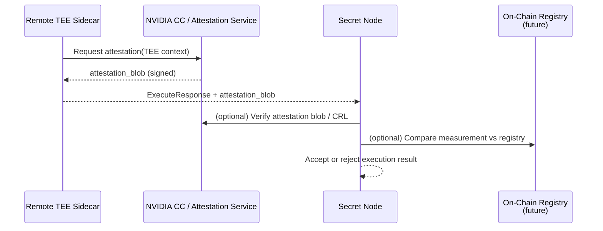

````markdown
# ARCHITECTURE

> **Project:** Secret Network – TEE-Agnostic Node with NVIDIA Blackwell Remote Backend  
> **Status:** Experimental / R&D

This document describes the high-level architecture of the **TEE-agnostic Secret node** and its interaction with a **remote NVIDIA Blackwell–based confidential computing backend**.

It focuses on:

- components and boundaries,
- execution flow for contract calls,
- attestation / trust flows,
- compatibility with existing SGX-based nodes.

---

## 1. Component Overview

The system consists of three main layers:

1. **Secret Node (TEE-Agnostic)**
2. **Remote TEE Sidecar (NVIDIA Blackwell)**
3. **On-Chain Attestation / TEE Registry (optional, future)**

### 1.1 Component Diagram

```mermaid
graph LR
  subgraph SecretNode["Secret Node (TEE-Agnostic)"]
    A[Cosmos SDK<br/>+ CometBFT]
    B[x/compute Module]
    C[TEEBackend Interface]
    C1[SgxBackend]
    C2[RemoteBackend]
  end

  subgraph RemoteTEE["Remote TEE Sidecar<br/>(NVIDIA Blackwell)"]
    D[gRPC / RPC Server]
    E[CosmWasm VM<br/>(Deterministic)]
    F[NVIDIA CC TEE<br/>Session (GPU/CPU)]
  end

  subgraph OnChain["On-Chain (Secret)"]
    G[Contracts / Modules]
    H[TEE/TCB Registry<br/>(future)]
  end

  A --> B
  B --> C
  C --> C1
  C --> C2

  C2 -->|Execute/Query| D
  D --> E
  E --> F
  F --> D
  D -->|Result + Attestation| C2

  A --> G
  G --> H
````

**Key ideas:**

* The Secret node no longer hard-codes SGX; it talks to a **`TEEBackend`** abstraction.
* `SgxBackend` wraps the existing SGX enclave.
* `RemoteBackend` sends execution requests to a **Remote TEE Sidecar**, which runs CosmWasm inside a **GPU TEE** (NVIDIA Confidential Computing).
* An optional **TEE/TCB Registry** can be used to store whitelisted measurements and vendor-specific TCB metadata.

---

## 2. TEE Backend Abstraction

The `TEEBackend` abstraction decouples:

* **Consensus / state machine** (Cosmos SDK, CometBFT, `x/compute`)
  from
* **Execution environment** (SGX enclave vs remote GPU TEE).

### 2.1 Conceptual Interface

```text
TEEBackend
 ├─ init(config)
 ├─ execute_contract(code, env, msg) -> bytes
 ├─ query_contract(code, env, msg) -> bytes
 ├─ get_consensus_keys() -> ConsensusKeys
 └─ attest() -> AttestationReport
```

Concrete implementations:

* `SgxBackend`

  * Calls SGX enclave via ECALL/OCALL as today.
* `RemoteBackend`

  * Sends requests over RPC to the remote sidecar and verifies returned attestation.

---

## 3. Execution Flow (Remote Backend)

This section describes what happens when a contract is executed using the Remote TEE Backend.

### 3.1 Sequence Diagram – Contract Execution



**Notes:**

* Determinism is enforced at the VM level: given the same inputs, all honest sidecars must return the same output.
* Attestation is bound to the VM/environment; the node verifies it before trusting the result.

---

## 4. Attestation and Trust Model

The system needs a common way to represent and verify **attestation** from different TEEs.

### 4.1 Generic Attestation Structure

Conceptually:

```text
AttestationReport
 ├─ tee_kind        (e.g., IntelSgx, RemoteNvTee)
 ├─ measurement     (hash of code + config)
 ├─ vendor_sig      (signature from vendor/infrastructure)
 ├─ tcb_version
 └─ timestamp
```

* `tee_kind`
  Identifies the TEE vendor / backend type.
* `measurement`
  Represents the enclave/TEE code identity.
* `vendor_sig`
  Signature or proof chain from Intel, NVIDIA, etc.
* `tcb_version`
  Trusted computing base version / patch level.

### 4.2 Attestation Flow



Two verification modes:

1. **Off-chain vendor verification**

   * Node validates the attestation using vendor-provided libraries / root certs.
2. **On-chain registry**

   * Node checks that `measurement` is present and allowed in an on-chain TEE/TCB registry.

---

## 5. Compatibility with Existing SGX Nodes

The architecture is designed to **coexist** with the current SGX-based Secret network.

### 5.1 Dual Backend Strategy

* **SGX nodes**:

  * Configure node to use `SgxBackend`.
  * Behaviour identical to current Secret Network.

* **Experimental nodes**:

  * Configure node to use `RemoteBackend`.
  * Delegate execution to Remote TEE Sidecar.

As long as both backends:

* use the **same CosmWasm VM semantics**,
* remain **deterministic**,

they should produce identical state transitions for the same inputs.

### 5.2 Deployment Modes

1. **Isolated Devnet**

   * Use only RemoteBackend nodes + sidecars.
   * Useful for initial integration and debugging.

2. **Mixed Testnet (Advanced)**

   * Some nodes use `SgxBackend`, others use `RemoteBackend`.
   * Compare behaviour and outputs under real workloads.

3. **Mainnet (Hypothetical / Future)**

   * Would require governance decisions, extensive audits, and agreement on trust / attestation policies.

---

## 6. Failure Modes and Fallbacks

The system must handle failures gracefully:

* **Sidecar unavailability / timeout**

  * Node should:

    * fail the transaction, or
    * switch to a fallback backend (e.g., SGX) if configured and safe.

* **Attestation verification failure**

  * Execution results MUST be rejected.
  * Node should emit diagnostics/logs and possibly shut down or degrade.

* **Non-determinism detected**

  * If discrepancies between SGX and Remote backends are observed on a testnet:

    * Flag the build as unsafe;
    * Block RemoteBackend in production-like environments until fixed.

---

## 7. Summary

The architecture introduces:

* A **TEE abstraction layer** (`TEEBackend`) to decouple Secret’s execution model from a single vendor (SGX).
* A **Remote TEE Sidecar** that can leverage NVIDIA Blackwell’s confidential computing capabilities for executing CosmWasm contracts.
* A **generic attestation model** capable of representing multiple TEEs (Intel SGX, NVIDIA GPU TEE, etc.).
* A clear path for **compatibility and coexistence** with existing SGX-based nodes in devnet / testnet environments.

This design is intentionally modular, so that additional TEEs (e.g., AMD SEV-SNP, Intel TDX) can be integrated by implementing new backends and extending the attestation registry policy.

---
